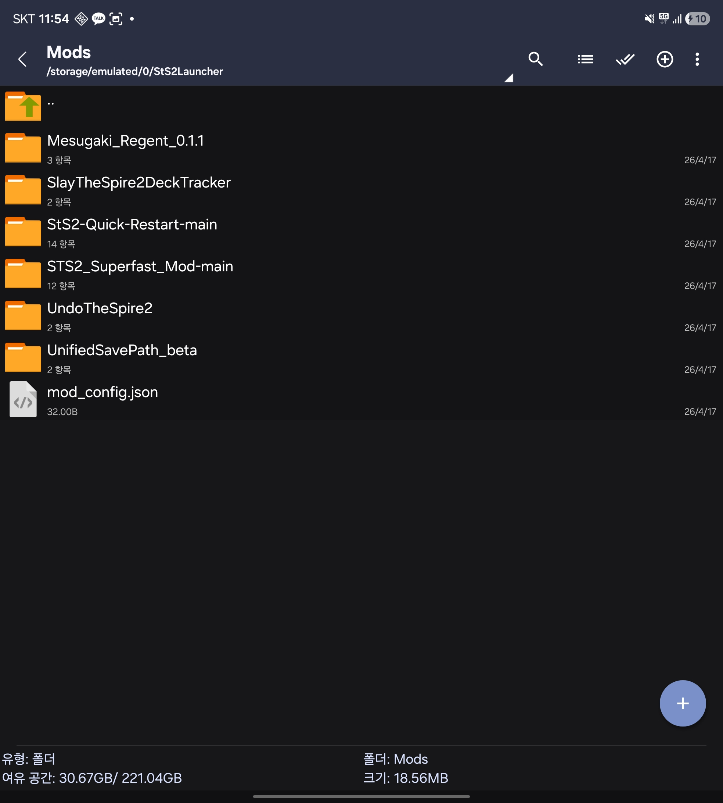

# StS2 Launcher (Mod Manager Fork)

An Android launcher for Slay the Spire 2, built on a custom Godot 4.5.1 engine with .NET/Mono and Harmony runtime patching.

> **Fork notice**: This is a community fork of [Ekyso/StS2-Launcher](https://github.com/Ekyso/StS2-Launcher). The upstream launcher's mod loader stopped working with recent game builds; this fork fixes that and adds a few mobile-UX tweaks. See **[Fork changes](#fork-changes-v022)** below.

> **Disclaimer**: This is an unofficial community project. Slay the Spire 2 is developed and published by Mega Crit Games. A valid Steam account that owns Slay the Spire 2 is required. Game files are downloaded directly from Steam after authentication. No game assets are included in this repository.

## Fork changes (v0.2.2)

Versioned as **0.2.2 (versionCode 212)**. Installs cleanly over the official 0.2.0 / our 0.2.1 with `adb install -r` — the 3GB game payload, saves, and credentials are preserved as long as the APK keystore signature matches.

1. **Steam branch picker.** Tapping `CHECK FOR UPDATES` (or `DOWNLOAD GAME FILES` on a fresh install) now lists every public Steam branch — `public`, `public-beta`, etc. — pulled from `PICSGetProductInfo`. Pick a branch and the launcher checks/downloads against it. Selection is persisted to `OS.GetDataDir()/selected_branch`. Password-gated betas are listed but greyed out (slated for a later release).
2. **Branch-switch forces a fresh download.** Switching branches wipes `game/` + `download_state/` and pulls every file from scratch. The delta path occasionally produced byte-correct-by-SHA but visually broken installs (e.g. card art mismatched against the wrong slot) when crossing `public ↔ public-beta`; full redownload (~3GB) sidesteps that until the underlying delta gap is identified. Login, saves, and the ownership marker are kept.
3. **Mod-screen suppression on `public-beta`.** The MegaCrit beta build auto-opens an in-game `NSendFeedbackScreen` whose category dropdown throws `NullReferenceException` from `LocString.GetFormattedText` (missing localization rows in beta), leaving a stuck "Sending" overlay. We reflect over `MegaCrit.Sts2.Core.Nodes.Screens.FeedbackScreen.*` and force `_Ready` to skip with `Visible=false`, sidestepping the broken UI without disposing the node (which would crash `ScreenContext` polling on `NMainMenu`).
4. **Storage-permission prompt up front.** `All Files Access` is requested once on first launch via a confirmation dialog. Mods, save backup, and any future external-storage features depend on it; previously the request was buried inside the Mod Manager flow that the user might never reach.
5. **Branch picker hit-target.** The radio rows in the picker are wrapped in a flat `Button` so tapping anywhere on the row toggles the radio, with the `CheckBox` icon enlarged to ~28dp (issue #2).

## Fork changes (v0.2.1)

Versioned as **0.2.1 (versionCode 201)**.

1. **Mods load on current game versions.** The upstream reflection-based `ModLoaderPatches` (scanning after `ModManager.Initialize`) crashed with `NullReferenceException` on current game builds because the private field names it touched were renamed. This fork replaces the approach with a Harmony IL transpiler that rewrites `Path.Combine(..., "mods")` inside `ModManager.Initialize` itself, so the game's own recursive scanner walks `/storage/emulated/0/StS2Launcher/Mods/`. The Steam-only mod enumerator (`ReadSteamMods`) is also short-circuited because Android has no Steamworks runtime.
2. **Foldable UX.** `android:resizeableActivity="true"` so folding/unfolding triggers a smooth resize instead of Samsung's "Reopen app" prompt (see issue #1).
3. **Back-button guard.** A stray back swipe no longer instantly restarts the launcher and drops your in-progress run — the first press shows a "Press back again to exit" toast, and only a second press within 2 seconds propagates.

## Installing mods

> **Heads up**: the "MOD MANAGER" button beneath PLAY on the login screen is a **TBD / work-in-progress UI**. The in-launcher SAF import flow is not wired up yet, so use the manual file-manager method below until it is.

1. Grant the launcher "All files access" on first run when it prompts. Once granted, the launcher creates `/storage/emulated/0/StS2Launcher/Mods/` on its own.
2. Install any Android file manager that can browse internal storage — Material Files, Solid Explorer, FE File Explorer, Samsung's built-in **내 파일**, etc.
3. Navigate to `/storage/emulated/0/StS2Launcher/Mods/` and drop each mod as its own subfolder. A valid mod folder contains the mod's `.dll`, optional `.pck`, and a `<ModId>.json` manifest at its root — the same layout PC users paste into `Steam\steamapps\common\Slay the Spire 2\mods\`.

   

4. Launch the game and tap PLAY. When the game's built-in "Load mods?" dialog appears, tap **OK** — the game will save the choice, restart through the launcher once, and come back up with mods loaded.

If no mods appear, check `adb logcat | grep "\[Mods\]"` — successful scans log `Redirected ModManager.Initialize to /storage/emulated/0/StS2Launcher/Mods`.

## Features

- **Steam authentication**  
  Login via SteamKit2 with Steam Guard 2FA support.
- **Game file download**  
  Depot download directly from Steam, with update checking.
- **Cloud saves**  
  Full Steam cloud sync via SteamKit2's CCloud API, with timestamp-aware conflict resolution and non-blocking background uploads.
- **Mobile adaptation**  
  Touch input, UI scaling, layout adjustments, and app lifecycle handling via Harmony runtime patches.
- **LAN multiplayer**  
  UDP broadcast discovery and manual IP join.
- **Shader warmup**  
  Vulkan pipeline cache persistence and canvas ubershader support to eliminate first-encounter stutters.
- **Credential security**  
  Steam refresh tokens encrypted at rest via Android Keystore (AES-256-GCM, hardware-backed TEE).

## How It Works

At startup, `STS2Mobile.dll` is loaded via `coreclr_create_delegate` and applies [Harmony](https://github.com/pardeike/Harmony) patches to adapt the desktop game for mobile. The launcher intercepts `GameStartupWrapper()` to present a Steam login screen before the game starts.

- **Launcher-only mode**  
If no game files are present, the app loads a minimal `bootstrap.pck` and shows the launcher UI for Steam login and game download.  
- **Normal mode**  
With game files downloaded, all patches apply against `sts2.dll` and the game runs natively after authentication.

## Engine Patches

Custom patches to the Godot 4.5.1 engine source for Android-specific issues:

- **Vulkan pipeline cache persistence**  
Saves compiled pipelines when the app loses focus, preventing recompilation after Android kills the process.
- **Canvas ubershaders**  
Enable ubershader fallback for 2D rendering, eliminating first-encounter VFX stutters from blocking pipeline compilation.

## Project Structure

```
src/STS2Mobile/
  ModEntry.cs              # Entry point ([UnmanagedCallersOnly] Apply())
  PatchHelper.cs           # Shared patch utility + logging
  Patches/                 # Harmony patches (one file per concern)
  Launcher/                # Programmatic Godot UI (MVC)
  Steam/                   # SteamKit2 login, depot download, cloud saves
android/                   # Godot Android gradle project
  src/.../GodotApp.java    # Activity, assembly setup, Keystore encryption
  assets/bootstrap.pck     # Minimal PCK for launcher-only mode
src/stubs/                 # Native library stubs (Steam API, Sentry)
scripts/                   # Build and tooling scripts
```

## Prerequisites

- .NET 9 SDK
- Android SDK + NDK (see `android/config.gradle` for versions)
- Python 3 (for `make-bootstrap-pck.py` and SCons)
- Original game files in `upstream/godot-export/`
- Custom Godot engine build (see `scripts/build-godot.sh`)
- FMOD SDK in `vendor/fmod-sdk/`

## Building

**Note: This is a WIP. There are other binaries that are required and will fail if you just run the `./build.sh` script. Godot Engine can be found on their repo https://github.com/godotengine/godot. Harmony can be found here https://github.com/Ekyso/Harmony but the version used in StS2 Launcher is compiled using dotnet 9.0. FMOD can be found here https://www.fmod.com/. Spine can be found here https://esotericsoftware.com/. I plan to upload the custom fork of Godot Engine used and the dotnet 9.0 Harmony soon. However, Spine and FMOD will not be uploaded due to licensing restrictions. Information on licensing can be found in the [THIRD-PARTY-NOTICES.txt](https://github.com/Ekyso/StS2-Launcher/blob/main/THIRD_PARTY_LICENSES.md) of the root folder.** 

```bash
bash scripts/build.sh
```

This runs the full pipeline:
1. `dotnet publish` the patcher (outputs `STS2Mobile.dll` + SteamKit2 dependencies)
2. Copies published DLLs to `android/assets/dotnet_bcl/`
3. Copies `libSystem.Security.Cryptography.Native.Android.so` to JNI libs (for TLS)
4. Bumps the version in `gradle.properties`
5. Builds the APK via `./gradlew assembleMonoRelease`

Output: `android/build/outputs/apk/mono/release/StS2Launcher-v<version>.apk`

### Installing

```bash
adb install -r android/build/outputs/apk/mono/release/StS2Launcher-v*.apk

# Fresh install (clear saved credentials + cached assemblies)
adb shell pm clear com.game.sts2launcher
```

### Other build tasks

```bash
# Regenerate bootstrap PCK (only if project.godot changes)
python3 scripts/make-bootstrap-pck.py

# Rebuild Godot engine (only if engine source changes)
bash scripts/build-godot.sh

# Rebuild native stubs (requires Android NDK)
bash src/stubs/build_stubs.sh
```

## LAN Multiplayer

Both devices must be on the same local network. The mobile app discovers nearby games via UDP broadcast, or you can enter the PC's IP address manually.

On the PC, add `--fastmp` to the Steam launch options:
**Steam > Slay the Spire 2 > Properties > Launch Options** and enter `--fastmp`

This enables the fast multiplayer mode that the mobile client expects.

## Technical Notes

- Native library stubs (`src/stubs/`) provide no-op `.so` files for desktop-only libraries (Steamworks SDK, Sentry) so the linker is satisfied at runtime.
- The bootstrap PCK is a minimal `project.godot` wrapper that enables .NET module initialization without game files.
- The game's Sentry plugin has no `android.arm64` build, so it's disabled via PCK patching and Harmony patches.
- GodotSharp interop is manually bootstrapped in `ModEntry.cs` since the Godot SDK source generators aren't available.

## License

This project is licensed under the [MIT License](LICENSE). See [THIRD_PARTY_LICENSES.md](THIRD_PARTY_LICENSES.md) for third-party dependency licenses.

FMOD requires a commercial license if your project generates revenue. Spine Runtimes require a valid Spine Editor license. See the third-party licenses file for details.
