# StS2 Launcher Mod 사용설명서

처음 설치하는 사용자를 위한 단계별 가이드입니다. 각 단계마다 폰 화면이 어떻게 보이는지 스크린샷과 함께 설명합니다.

> **검증된 환경**: Galaxy Z Fold7 (메인 + 커버 화면 양쪽). 다른 폼팩터 (태블릿 등) 는 [이슈 #6](https://github.com/iunius612/StS2-Launcher_Mod_Manager/issues/6) 참조.

---

## 목차

1. [APK 다운로드 + 설치](#1-apk-다운로드--설치)
2. [첫 실행 — 권한 부여](#2-첫-실행--권한-부여)
3. [Steam 로그인](#3-steam-로그인)
4. [브랜치 선택 + 게임 다운로드](#4-브랜치-선택--게임-다운로드)
5. [런처 메인 화면 한눈에 보기](#5-런처-메인-화면-한눈에-보기)
6. [게임 실행 (PLAY)](#6-게임-실행-play)
7. [브랜치 변경 (CHECK FOR UPDATES)](#7-브랜치-변경-check-for-updates)
8. [Auto Sync 토글](#8-auto-sync-토글)
9. [Save Manager 다이얼로그 사용법](#9-save-manager-다이얼로그-사용법)
10. [수동 Push / Pull](#10-수동-push--pull)
11. [Local Backup 토글](#11-local-backup-토글)
12. [모드 설치 (선택)](#12-모드-설치-선택)
13. [자주 묻는 질문 (FAQ)](#13-자주-묻는-질문-faq)
14. [알려진 문제 / 미지원 환경](#14-알려진-문제--미지원-환경)

---

## 1. APK 다운로드 + 설치

[Releases 페이지](https://github.com/iunius612/StS2-Launcher_Mod_Manager/releases/latest) 에서 가장 최신 버전의 `StS2Launcher-vX.Y.Z.apk` 파일을 폰으로 다운로드합니다.

  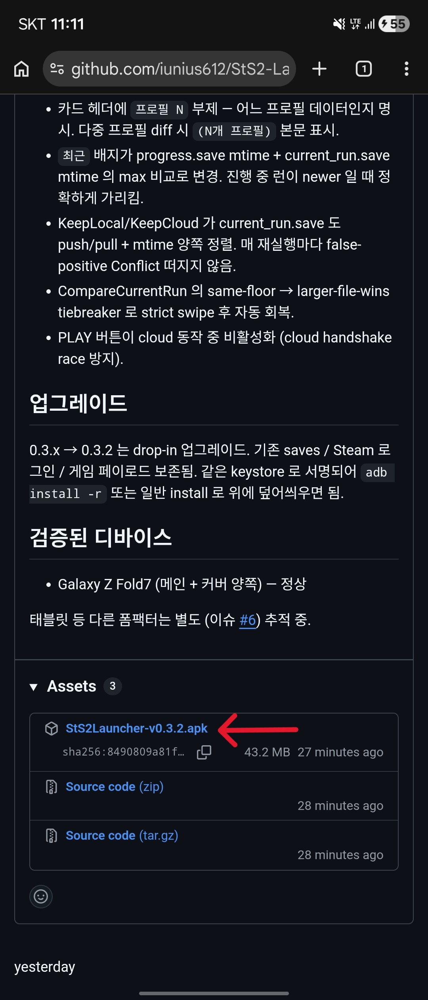

설치 시 **"출처를 알 수 없는 앱"** 허용이 필요할 수 있습니다. 폰 브라우저나 파일 매니저가 처음 APK 를 설치할 때 한 번씩 권한 요청 다이얼로그가 뜹니다.

  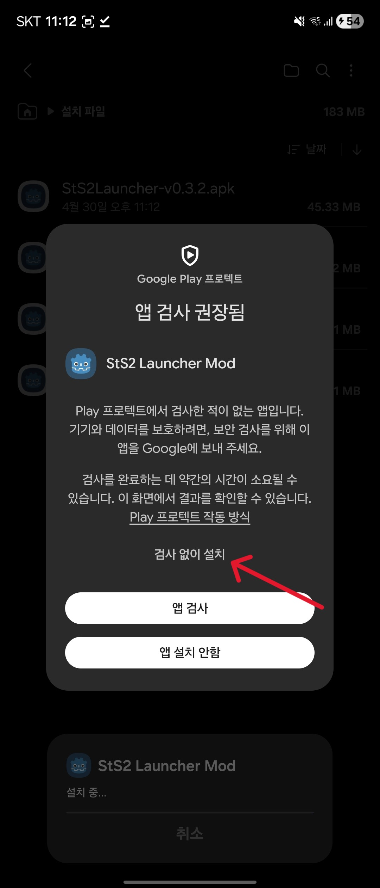

> **업그레이드 시**: 같은 keystore 로 서명된 빌드를 위에 덮어 설치하면 saves / Steam 로그인 / 게임 페이로드 (~3GB) 모두 보존됩니다. 0.3.x → 0.3.2 같은 마이너 업그레이드는 데이터 그대로.

---

## 2. 첫 실행 — 권한 부여

런처를 처음 실행하면 **"모든 파일 액세스 (All Files Access)"** 권한 요청 다이얼로그가 뜹니다.

  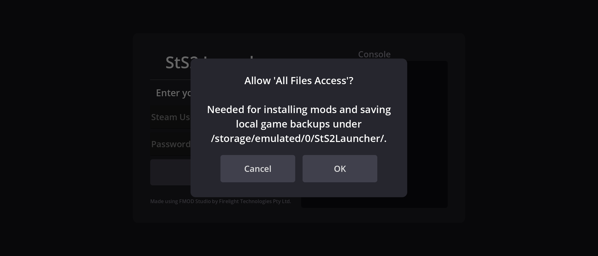

이 권한이 필요한 이유는:
- 모드 폴더 (`/storage/emulated/0/StS2LauncherMM/Mods/`) 에 사용자가 직접 모드를 넣을 수 있어야 하고,
- (선택) Local Backup 기능이 외부 저장공간에 `.bak` 파일을 저장하려면 외부 storage 쓰기 권한이 필요합니다.

권한 부여 화면에서 토글을 켜고 뒤로가기를 누르면 런처로 복귀합니다.

  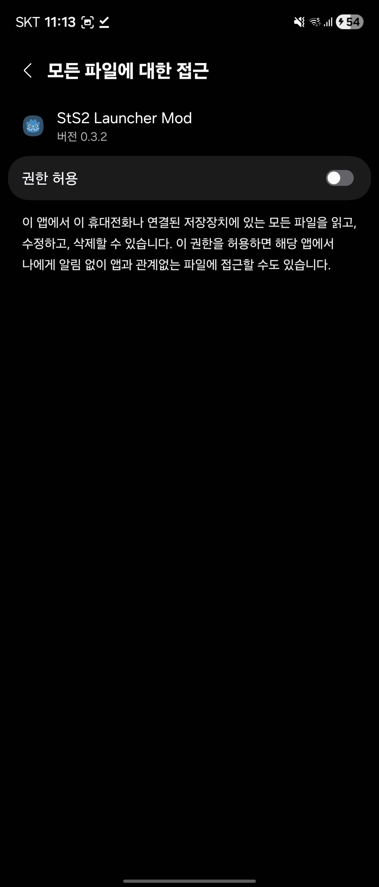

---

## 3. Steam 로그인

런처 화면에서 Steam 로그인 안내가 표시되면 본인의 Steam 계정 정보를 입력합니다.

  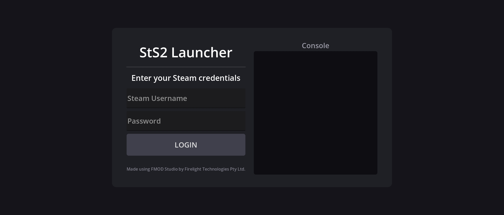

### ⚠️ Steam Guard 2FA 주의사항

2단계 인증 코드를 받기 위해 다른 앱 (Steam 모바일 앱 등) 으로 전환하면 **인증 세션이 약 5~10 초만 백그라운드에 있어도 fail 처리**됩니다. 처음부터 다시 입력해야 함.

  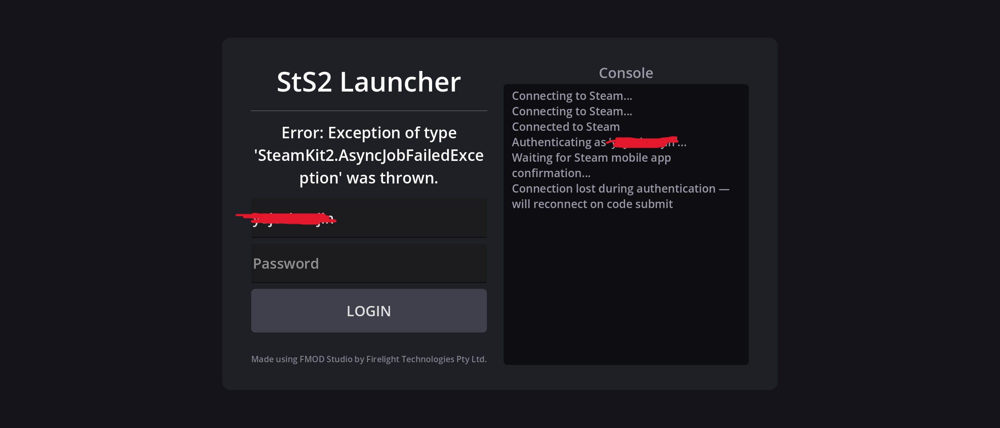

**대처법**:
- **팝업/포커스 모드**: Steam 모바일 앱을 팝업 창으로 띄워서 코드를 확인 → 즉시 런처를 다시 터치해 포커스 유지.
- **분할 화면**: 런처와 Steam 앱을 동시에 띄워서 한쪽 보고 다른 쪽 입력.
- **빠른 입력**: 코드 메모해 두고 런처에 빠르게 입력.

  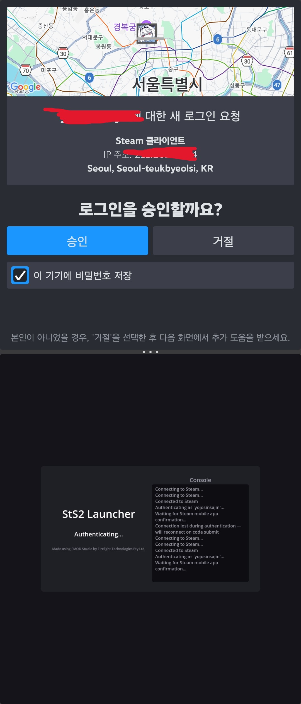

---

## 4. 브랜치 선택 + 게임 다운로드

로그인 성공 후 게임 파일이 없는 상태라면 **브랜치 선택 화면**이 표시됩니다.

  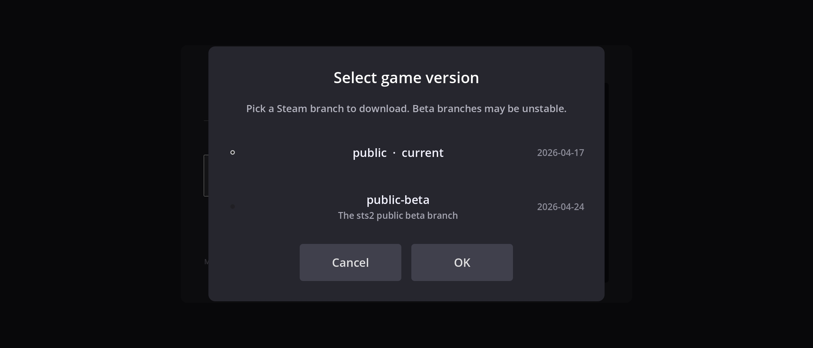

> **PC 와 같은 브랜치를 선택하세요.** 모바일에서 베타 브랜치 진행도를 PC 의 일반 브랜치로 가져갈 수 없고, 그 반대도 마찬가지입니다 (Steam Cloud sync 충돌 발생). 자세한 내용은 FAQ 참조.

브랜치를 고르고 다운로드 버튼을 누르면 약 **3GB** 의 게임 파일이 다운로드됩니다. 와이파이 권장.

  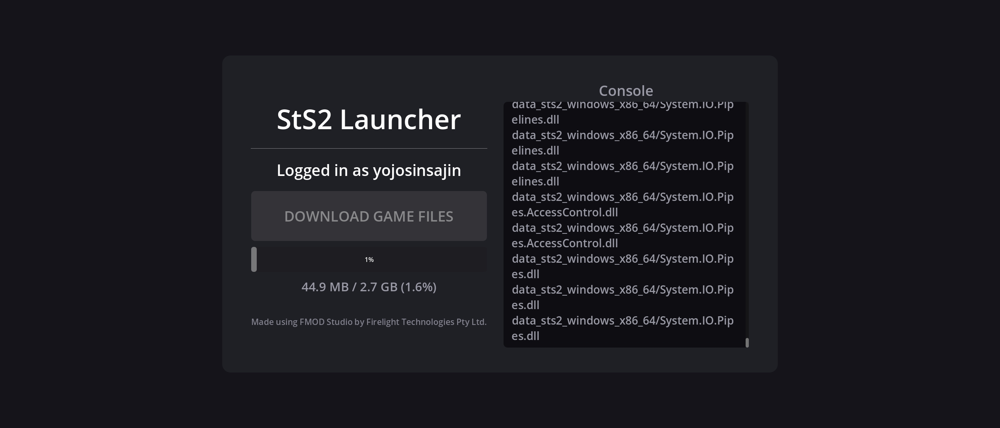

---

## 5. 런처 메인 화면 한눈에 보기

다운로드 완료 후 보이는 메인 런처 화면입니다. 각 영역 기능을 한 줄로 정리하고, 자세한 사용은 아래 섹션에서 다룹니다.

  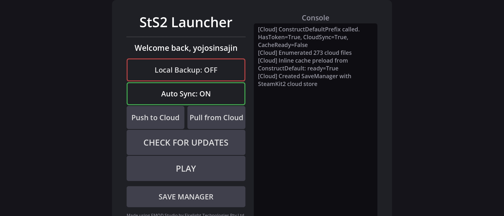

| 영역 | 기능 | 자세한 사용 |
|---|---|---|
| **PLAY** 버튼 | 게임 실행. 이걸 누르면 Steam Cloud 와 진행도 동기화 검증 후 게임 본체 진입 | [6번](#6-게임-실행-play) |
| **CHECK FOR UPDATES** 버튼 | 게임 업데이트 확인 + **브랜치 변경** (이미 다운된 경우에도 다른 브랜치로 갈아탈 수 있음) | [7번](#7-브랜치-변경-check-for-updates) |
| **Auto Sync** 토글 | Steam Cloud 와의 자동 동기화 ON/OFF | [8번](#8-auto-sync-토글) |
| **SAVE MANAGER** 버튼 | 현재 sync 상태 확인 + 강제 재sync 다이얼로그. cloud / local 비교 + 수동 결정 | [9번](#9-save-manager-다이얼로그-사용법) |
| **Push** 버튼 | 모든 saves 를 Steam Cloud 로 강제 업로드 (특수 상황용) | [10번](#10-수동-push--pull) |
| **Pull** 버튼 | Steam Cloud 의 모든 saves 를 폰으로 강제 다운로드 (특수 상황용) | [10번](#10-수동-push--pull) |
| **Local Backup** 토글 | cloud sync 가 local 을 덮어쓰기 직전에 외부 저장공간에 `.bak` 자동 백업 | [11번](#11-local-backup-토글) |

> 모드 매니저 버튼은 0.3.0 부터 위 SAVE MANAGER 로 변경됐습니다. 모드 설치는 외부 파일 매니저로 진행 — [12번](#12-모드-설치-선택) 참조.

---

## 6. 게임 실행 (PLAY)

런처 화면에서 PLAY 를 누르면 **Steam Cloud 와의 진행도 동기화 검증**이 먼저 진행됩니다.
잠시 검은화면이 출력 되지만, save manager가 클라우드에서 파일을 다운로드 받는 것이므로 기다려주세요.
(30초 ~ 1분 초과 시 네트워크 연결 지연 등, 버그 의심)

  

검증 결과에 따라 다음 중 하나가 발생:

- **양쪽 진행도 일치 또는 데이터 없음**: 즉시 게임 메인메뉴로 진입 (다이얼로그 안 뜸).
- **한쪽에만 진행도 있음 또는 양쪽 다름**: **Save Manager 다이얼로그**가 자동으로 표시됨 → [9번](#9-save-manager-다이얼로그-사용법) 참조.

이후 첫 실행 시 게임 내 쉐이더 스캐닝 및 압축해제 가 진행 됩니다.

  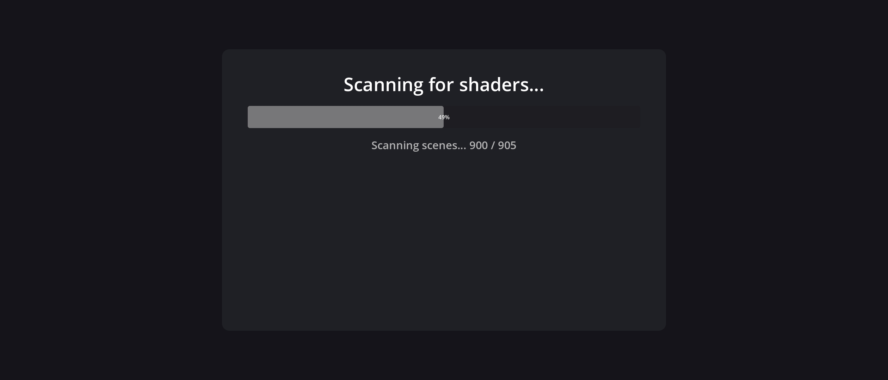


쉐이더 업데이트가 끝나면 잠시 후 런처 메인화면으로 복귀합니다.

이후 게임 본체에 진입하면 일반적인 Slay the Spire 2 플레이 흐름과 동일.

> 게임 종료 시 (게임 메뉴 → Quit) launcher 가 cloud 큐가 비워질 때까지 (최대 5분, 보통 1~5초) 기다립니다. 이 동안 process 는 백그라운드에 살아있고 Steam 네트워크 트래픽이 잠깐 보일 수 있음 — 정상 동작.

---

## 7. 브랜치 변경 (CHECK FOR UPDATES)

이미 게임을 다운로드한 상태라도 **CHECK FOR UPDATES** 버튼을 누르면 브랜치 선택 화면이 다시 열립니다. 다른 브랜치 (예: `public` → `public-beta`) 로 갈아타고 싶을 때 사용.

  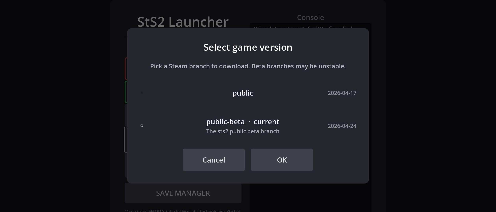

### 브랜치 변경 시 주의사항

- **새 브랜치는 풀 재다운로드** (~3GB). delta 다운로드 사용 안 함 — 브랜치 간 binary 차이가 byte 단위로 호환되지 않을 수 있어 의도적으로 처음부터 다시 받음.
- **saves / Steam 로그인 / 모드 설정은 보존**됩니다. 게임 파일 (`game/`, `download_state/`) 만 새로 받음.
- **PC 와 브랜치를 일치시키세요** — 다른 브랜치끼리는 Steam Cloud sync 가 충돌할 수 있음. [FAQ](#13-자주-묻는-질문-faq) 의 브랜치 일치 항목 참조.

---

## 8. Auto Sync 토글

런처 메인 화면의 **Auto Sync: ON / OFF** 토글로 Steam Cloud 자동 동기화를 끄거나 켤 수 있습니다.

  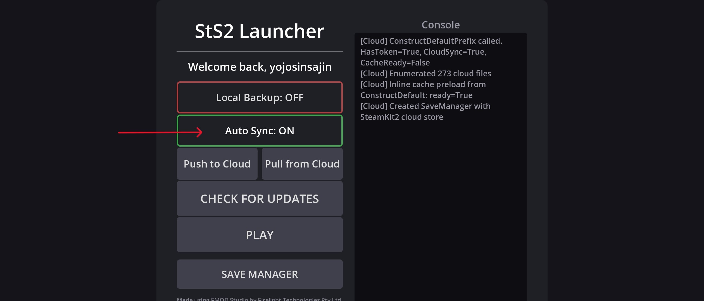

| 상태 | 동작 |
|---|---|
| **Auto Sync: ON** (기본) | 게임 진행 중 saves 가 Steam Cloud 로 자동 push, 다음 PLAY 시 자동 검증 다이얼로그 |
| **Auto Sync: OFF** | cloud 와 격리됨. 모바일 local 에만 saves 저장. 다른 디바이스 (PC 등) 와 진행도 동기화 안 됨 |

### 언제 OFF 로 두나?

거의 항상 ON 권장. OFF 가 필요한 특수 상황:

- **임시 디버깅**: cloud 측 sync 가 의심스러울 때 OFF 로 두고 모바일 local 만 진행 → 그 후 다시 ON 으로 돌리고 Save Manager 로 정확한 결정.
- **PC 와 의도적으로 다른 진행을 원할 때**: 모바일에서 별도 캐릭터/런 진행하고 PC 는 따로 두고 싶을 때. 다만 다음에 ON 하면 conflict 다이얼로그가 뜨므로 그때 결정 필요.

OFF 였다가 다시 ON 하면 **Save Manager 가 자동으로 conflict 검출**해 어느 쪽을 유지할지 묻습니다 — 다음 PLAY 시점에 다이얼로그가 뜸.

---

## 9. Save Manager 다이얼로그 사용법

Steam Cloud 와 폰 사이에 진행도 차이가 감지되면 다이얼로그가 자동으로 표시됩니다. 또는 런처 화면에서 **SAVE MANAGER** 버튼을 직접 탭하면 언제든지 현재 sync 상태를 확인할 수 있습니다.

### 다이얼로그 구성

각 카드는 한 프로필의 진행도 정보를 보여줍니다.

| 항목 | 의미 |
|---|---|
| **프로필 N** (부제) | 카드가 어느 프로필 데이터인지 (1, 2, 3 또는 모드 프로필) |
| **최근** 배지 | 두 카드 중 더 최근에 변경된 쪽 (progress.save 와 current_run.save 의 mtime 중 newer) |
| **파일 생성 시간 / 파일 크기** | progress.save 의 mtime / 사이즈 |
| **총 플레이타임** | 누적 플레이 시간 |
| **현재 진행** | 진행 중 런이 있다면 `1막 3층` 같이 표시. 없으면 `—` |
| **전적 / 최고 승천 / 올라간 층 / 발견 유물** | progress.save 의 누적 통계 |

### 상황별 다이얼로그 모습

#### 상황 1 — 다름 (conflict)

본문 "진행도가 다릅니다" + 두 카드 + **취소 / 로컬 유지 / 클라우드 유지** 버튼. 다중 프로필이 동시에 다르면 본문에 `(N개 프로필)` 표시.

  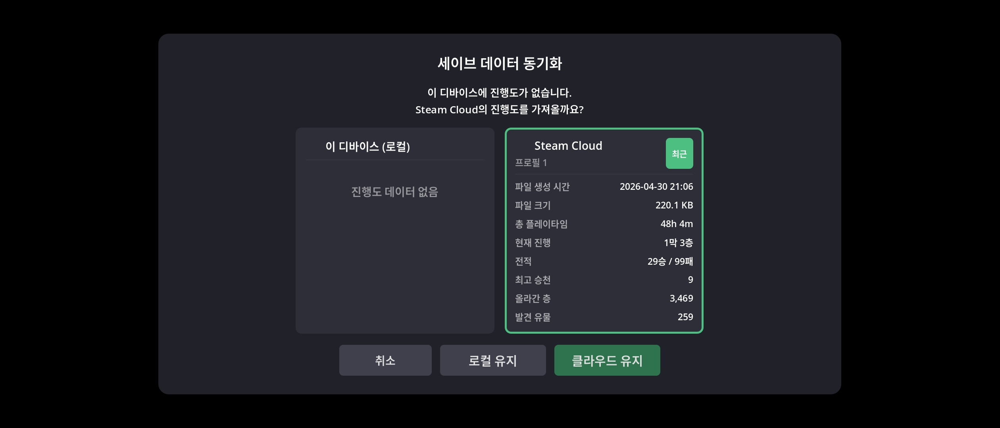

### 어느 쪽을 유지할지 결정 가이드

다이얼로그가 자동으로 더 newer 쪽 버튼을 강조 표시합니다 ("최근" 배지가 붙은 카드의 유지 버튼). 일반적인 결정 흐름:

| 상황 | 선택 |
|---|---|
| 모바일에서 방금 진행 → 다른 디바이스에 전달하려면 | **로컬 유지** |
| PC 에서 진행 후 모바일로 가져오려면 | **클라우드 유지** |
| 헷갈리면 | **취소** → 그 세션 cloud sync OFF, 다음 시작 시 다시 결정 가능 |

> **확신이 없을 때 안전하게**: "현재 진행" 행을 보세요. 두 카드 중 진행 중 런이 있는 쪽 또는 더 진행된 쪽 (예: 1막 5층 vs 1막 3층) 이 보통 사용자가 잃고 싶지 않은 데이터입니다.

#### 상황 2 — 양쪽 동일 (Identical)

두 카드의 사이즈/통계/현재 진행이 모두 같음. 본문 "일치합니다, 별도 작업이 필요하지 않습니다" + 닫기 버튼.

  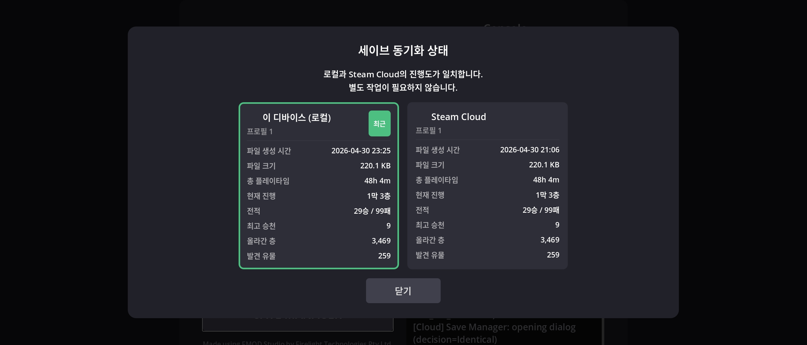

---

## 10. 수동 Push / Pull

런처 Actions 영역의 **Push** / **Pull** 버튼은 강제 동기화 도구입니다. **일반적인 사용에서는 권장하지 않습니다** — cloud 동기화는 게임 종료/실행 시 자동으로 처리되고, 자동 sync 가 깨지면 Save Manager 가 정확한 결정 옵션을 제공하기 때문.

  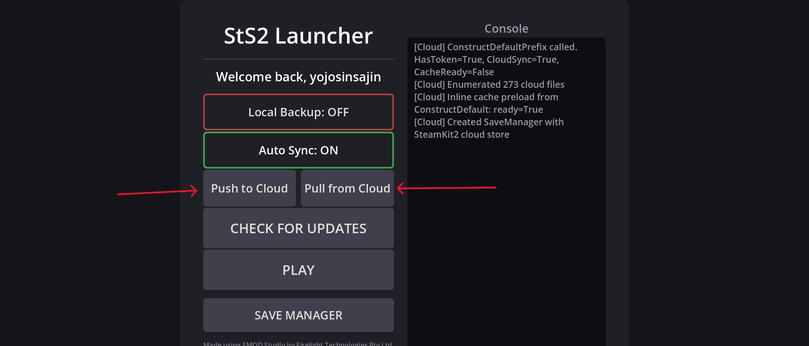

| 버튼 | 동작 |
|---|---|
| **Push** | 모바일 local 의 모든 saves (progress + current_run + history `.run` + prefs + settings × 모든 프로필) 를 Steam Cloud 로 강제 업로드 |
| **Pull** | Steam Cloud 의 모든 saves 를 모바일 local 로 강제 다운로드 |

### 언제 사용하나?

특수 상황 한정:

- **Save Manager 가 어떤 이유로 작동 안 함** (다이얼로그 응답 없음 등) — 강제로 한쪽 방향 sync 가 필요할 때.
- **PC 에서 진행 후 모바일로 옮길 때** Save Manager 가 자동 처리하지만, 명시적으로 한 번에 받고 싶으면 Pull.

> 일반 사용은 **PLAY 시점의 자동 검증 + Save Manager 다이얼로그** 흐름으로 충분합니다.

---

## 11. Local Backup 토글

런처 Actions 영역의 **Local Backup** 토글을 ON 으로 두면 cloud sync 가 local 파일을 덮어쓰기 직전에 외부 저장공간에 `.bak` 파일이 자동 저장됩니다.

  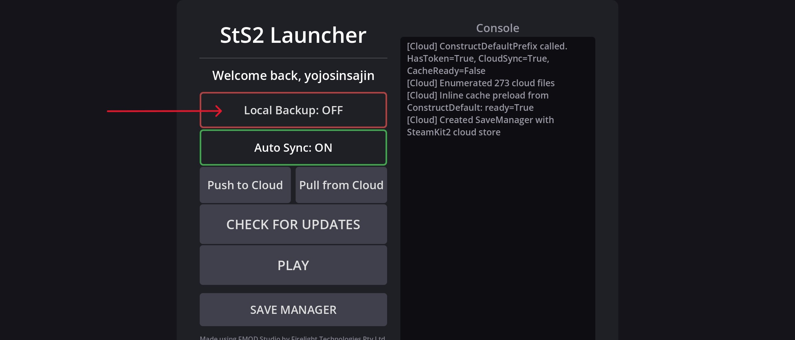

### 저장 위치

```
/storage/emulated/0/StS2LauncherMM/Saves/<프로필>/
  ├── progress.save.<unix_ts>.local.bak       (cloud wins 직전 local 백업)
  ├── progress.save.<unix_ts>.cloud.bak       (local wins 직전 cloud 백업)
  └── current_run.save.<unix_ts>.cloud-pre-push.bak
```

프로필당 50개까지 누적되며 가장 오래된 것부터 자동 정리됩니다.

### 사용 시나리오

- **써도 OK, 안 써도 OK**: 일반적인 사용에서는 cloud sync 자체가 안전합니다.
- **추천**: cross-device (PC ↔ 모바일) 를 자주 전환하는 사용자, 또는 destructive 사고를 한번 겪어본 사용자는 ON 권장. 잘못된 KeepLocal/KeepCloud 선택을 해도 `.bak` 파일에서 수동 회복 가능.
- **단점**: 외부 저장공간에 파일이 누적됨 (50개 한도라 폭주는 안 함).

> 회복 방법: 외부 파일 매니저나 PC `adb pull` 로 원하는 `.bak` 을 꺼내 → 게임 종료 상태에서 `.bak` 확장자를 떼고 본래 파일명으로 복원.

---

## 12. 모드 설치 (선택)

모드를 사용하려면:

1. **[ZArchiver](https://play.google.com/store/apps/details?id=ru.zdevs.zarchiver)** (Play Store 무료) 를 다운받아 사용을 권장합니다. 삼성 **내 파일** 등 일부 OEM 기본 파일 매니저는 안드로이드 scoped storage 정책 때문에 `/storage/emulated/0/StS2LauncherMM/` 경로가 보이지 않을 수 있습니다 (실제 검증).
2. ZArchiver 로 `/storage/emulated/0/StS2LauncherMM/Mods/` 경로 진입.
3. 모드 폴더 (예: `MyMod/`) 통째로 그 안에 복사. 폴더 내부에는 `.dll`, 선택적 `.pck`, `<ModId>.json` 매니페스트가 있어야 함. (PC와 동일, 다르지 않음)

  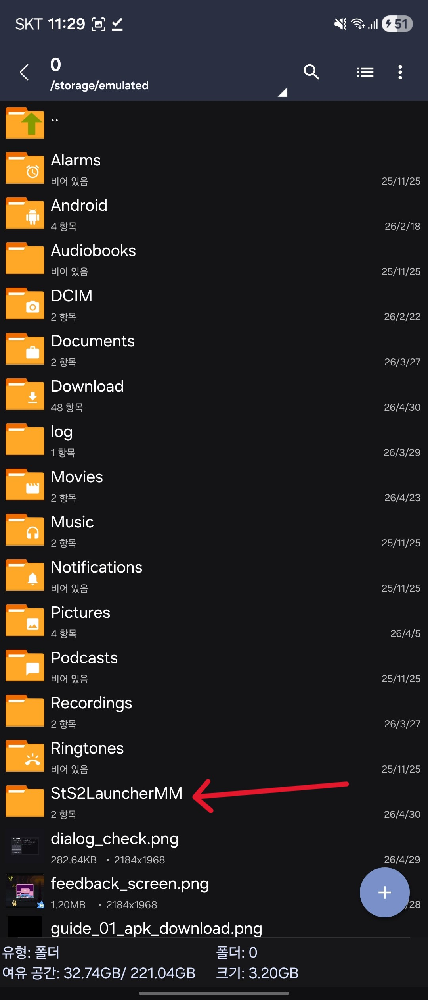
  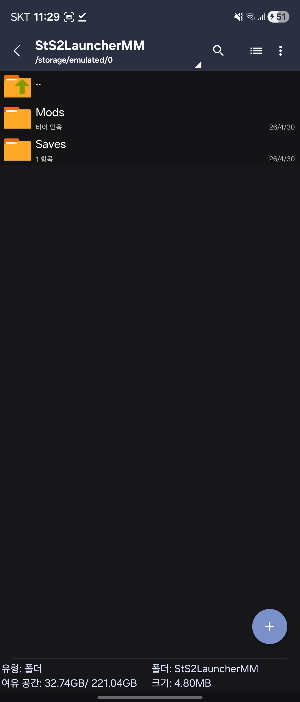
  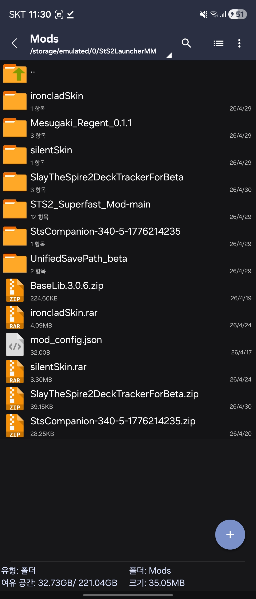

4. 게임 실행 시 게임 본체의 **"Load mods?"** 다이얼로그가 뜨면 OK 탭. 한 번 선택하면 그 다음부터 자동 로드.

  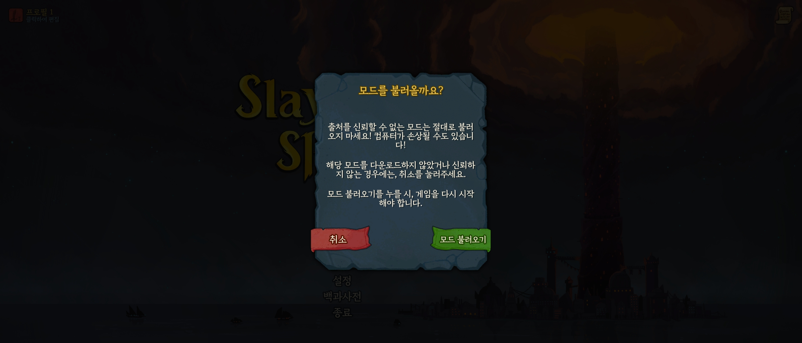

---

## 13. 자주 묻는 질문 (FAQ)

### Q. PC 와 모바일 브랜치가 달라도 sync 가 되나요?

경우에 따라 다릅니다.

- **세이브 스키마가 같은 두 브랜치** (예: 둘 다 minor 업데이트 차이) 라면 그대로 cloud sync 가 작동합니다.
- **스키마 변경이 있는 브랜치 차이** (예: PC 가 public, 모바일이 public-beta — beta 가 새 필드를 추가했다면) Steam Cloud 가 "sync 충돌" 다이얼로그를 띄우며 복구가 어려워질 수 있습니다.

**가장 안전한 cross-device 전환 절차** (검증 1회):
1. PC Steam → StS2 properties → 베타 탭에서 **모바일과 같은 브랜치** 선택.
2. PC StS2 한 번 실행 → 메인 메뉴 도달까지 본 후 종료. 이 과정에서 PC 의 saves 가 새 브랜치 스키마로 cloud 에 push 됨.
3. 모바일 런처에서 PLAY → Save Manager 다이얼로그가 cloud 의 새 데이터를 정확히 인식하면 그 후 KeepCloud 또는 자동 흐름으로 받기.

이 절차가 **항상 필요한 건 아닙니다** — 브랜치 차이가 사소하면 그냥 sync 됨. 다만 충돌이 발생했을 때 복구의 정석적 경로입니다.

### Q. Cloud 에 잘못된 데이터를 push 해버렸어요. 회복할 수 있나요?

PC 측이라면 [shrederr/sts2-progress-rebuild](https://github.com/shrederr/sts2-progress-rebuild) 도구가 `.run` 히스토리에서 `progress.save` 를 재구성해 cloud 까지 복구합니다.

모바일 local 만 잘못됐다면 (cloud 는 멀쩡) Save Manager 의 **클라우드 유지** 로 받으면 회복.

Local Backup 토글이 ON 이었다면 `/storage/emulated/0/StS2LauncherMM/Saves/<프로필>/` 의 `.bak` 파일에서 직접 복원 가능.
  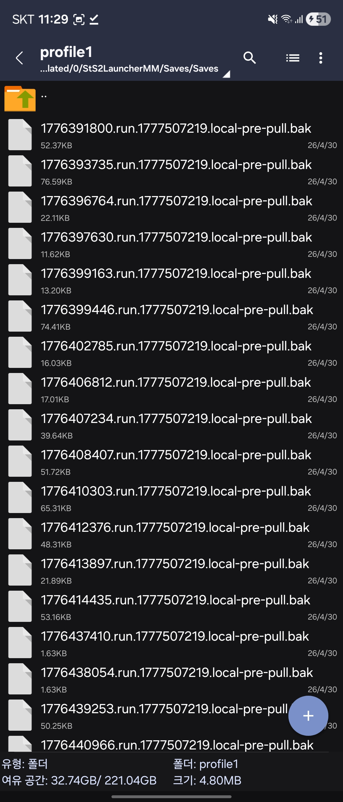

### Q. Save Manager 가 매번 "충돌" 이라고 떠요.

PC 와 모바일이 progress.save 를 자체적으로 미세하게 다르게 정규화하는 케이스가 있습니다 — 통계는 동일한데 사이즈만 수 KB 차이가 매번 발생. 0.3.2 의 destructive 차단 로직은 이 경우에도 안전하지만, UX 상 다이얼로그는 한 번씩 뜹니다. 별도 추적 중.

이때는 **로컬 유지** 또는 **클라우드 유지** 둘 중 시각적으로 더 newer 쪽 (방금 진행한 디바이스) 을 선택하면 됩니다.

### Q. 게임 종료 후 cloud upload 에 시간이 좀 걸리는 것 같은데요?

정상입니다. 0.3.0 이후 메뉴 → Quit 시점에 launcher 가 cloud 큐가 완전히 비워질 때까지 (최대 5분, 보통 1~5초) 기다립니다. 이 동안 process 는 백그라운드에 살아있고 Steam 네트워크 트래픽이 보일 수 있음.

### Q. 폰을 task switcher 에서 swipe 로 강제 종료하면 데이터 손실이 발생하나요?

0.3.2 이후로는 자동 회복됩니다. swipe 직후 cloud 큐가 다 비워지지 않더라도 다음 부팅 시 `SaveProgressComparer` 가 local newer 쪽을 정확히 감지해서 cloud 로 push.

다만 가능하면 **메뉴 → Quit** 으로 정상 종료하는 게 가장 안전합니다.

### Q. 게임 다운로드를 다시 받고 싶어요.

CHECK FOR UPDATES 로 다른 브랜치를 선택하면 자동으로 풀 재다운로드 됩니다. 같은 브랜치를 다시 받고 싶으면 일단 다른 브랜치 → 원래 브랜치 순서로 두 번 누르면 됨.

---

## 14. 알려진 문제 / 미지원 환경

| 문제 | 상태 |
|---|---|
| 일부 태블릿 (Lenovo Y700/Y704 등) 에서 런처 진입 실패 | [이슈 #6](https://github.com/iunius612/StS2-Launcher_Mod_Manager/issues/6) — device 로그 수집 중 |
| PC ↔ 폰 progress.save 사이즈 발산 (매 device 전환 시 conflict 다이얼로그 한 번씩 뜸) | 별도 추적 — destructive 영향은 0.3.2 에서 차단됨 |

새 문제가 발견되면 [이슈 트래커](https://github.com/iunius612/StS2-Launcher_Mod_Manager/issues) 에 등록 부탁드립니다. `adb logcat -d > sts2.log` 로 채취한 로그를 첨부해 주시면 분석에 큰 도움이 됩니다.

---

## 도움이 되는 명령어 (선택)

폰을 PC 에 USB 디버깅으로 연결한 사용자라면:

```bash
# 런처 logcat 보기
adb logcat -s DOTNET:I STS2Mobile:V godot:V

# 외부 저장 모드/세이브 폴더 보기
adb shell ls -la /storage/emulated/0/StS2LauncherMM/Mods/
adb shell ls -la /storage/emulated/0/StS2LauncherMM/Saves/

# 강제 초기화 (모든 데이터 삭제 후 새 사용자처럼 시작)
adb shell pm clear com.game.sts2launcher.modmanager
adb shell rm -rf /storage/emulated/0/StS2LauncherMM
```

---

*이 문서는 [iunius612/StS2-Launcher_Mod_Manager](https://github.com/iunius612/StS2-Launcher_Mod_Manager) 의 일부입니다. 잘못된 정보나 추가하고 싶은 항목이 있으면 PR 또는 이슈로 알려주세요.*
